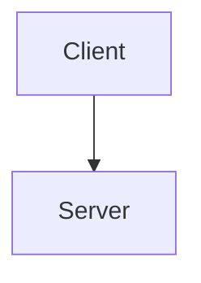
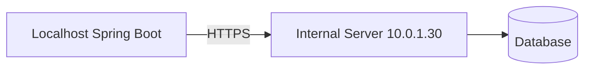
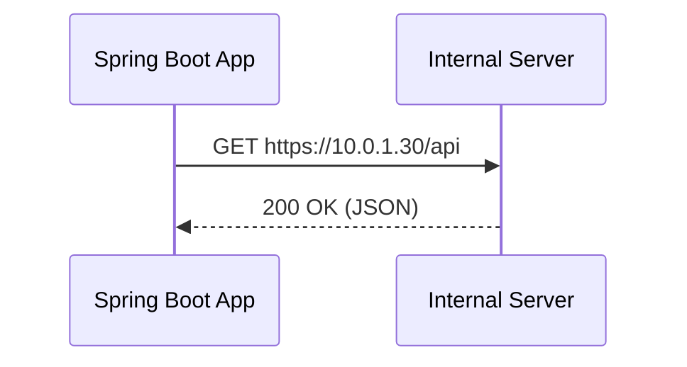
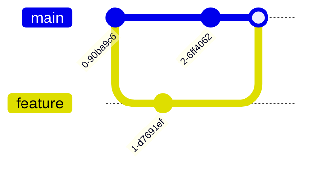

# Mermaid: what it is + how to view diagrams in your IDE (Feb 20, 2026)

## What is Mermaid?
**Mermaid** is a text-based diagramming syntax that lets you write diagrams in plain text and render them as visuals.

You typically embed Mermaid in Markdown using a fenced code block like:



### Why use it?
- **Version control friendly**: diffs are readable.
- **Fast to edit**: change a few lines instead of dragging shapes.
- **Works in many places**: GitHub, GitLab, many Markdown editors, docs sites.

### Common diagram types
- Flowcharts (`graph TD` / `flowchart LR`)
- Sequence diagrams (`sequenceDiagram`)
- Class diagrams (`classDiagram`)
- State diagrams (`stateDiagram-v2`)
- ER diagrams (`erDiagram`)
- Gantt charts (`gantt`)

---

## Viewing Mermaid diagrams in an IDE
There are two common “Visual Studio” editors people mean:
1. **Visual Studio (full IDE)** – for .NET/C++ and Windows development.
2. **Visual Studio Code (VS Code)** – lightweight editor.

Mermaid support is usually easiest in **VS Code**, but you *can* add it to Visual Studio too via extensions.

---

## Option A (recommended): VS Code
### Install a Mermaid/Markdown preview extension
In VS Code:
1. Open **Extensions** (Ctrl+Shift+X)
2. Search and install one of these popular options:
   - **Markdown Preview Mermaid Support** (adds Mermaid rendering in Markdown preview)
   - **Mermaid Markdown Syntax Highlighting** (syntax highlighting; often paired with a renderer)

> Note: Some VS Code versions and Markdown preview setups can already render Mermaid depending on your configuration, but installing a dedicated extension is the most reliable approach.

### Preview a Mermaid diagram
1. Open a Markdown file that contains Mermaid code blocks.
2. Open Markdown preview:
   - **Preview**: Ctrl+Shift+V
   - **Preview to the side**: Ctrl+K V
3. The ` ```mermaid ` blocks should render as diagrams.

### Optional: export diagrams
Many Mermaid extensions provide commands like “Export Mermaid diagram to PNG/SVG”.
Open the Command Palette (Ctrl+Shift+P) and search for “Mermaid: Export …”.

---

## Option B: Visual Studio (full IDE)
Visual Studio can preview Markdown, but Mermaid rendering depends on extensions.

### Install a Markdown extension with Mermaid support
1. Go to **Extensions → Manage Extensions**
2. Search for a Markdown extension that mentions Mermaid support.
   - Keywords to search: **Markdown**, **Mermaid**, **Diagram**
3. Install, restart Visual Studio, and open your `.md` file.

### If preview still doesn’t render
If Visual Studio’s Markdown preview doesn’t support Mermaid (common), the practical options are:
- Use **VS Code** for Markdown+Mermaid docs
- Render diagrams via Mermaid CLI (see below) and commit exported images alongside Markdown

---

## Mermaid CLI (works everywhere)
If you want a tool-based approach that doesn’t depend on IDE preview support, use Mermaid CLI.

### Install
Requires Node.js.

```powershell
npm install -g @mermaid-js/mermaid-cli
```

### Render a diagram to SVG/PNG
Create an input file (example: `diagram.mmd`), then:

```powershell
mmdc -i diagram.mmd -o diagram.svg
mmdc -i diagram.mmd -o diagram.png
```

---

## Copy/paste examples
### 1) Flowchart


### 2) Sequence diagram


### 3) Git branching (simple)


---

## Troubleshooting
### “Mermaid code shows as text, not a diagram”
- Confirm the fenced code block starts with **exactly** ` ```mermaid `.
- Ensure you’re viewing a **Markdown preview**, not just the text editor.
- Install a VS Code extension that explicitly renders Mermaid in Markdown.

### “Diagram doesn’t render / syntax error”
- Mermaid syntax is strict; a missing indent or typo can break rendering.
- Validate by pasting into the Mermaid Live Editor (if allowed in your environment) or by using Mermaid CLI.

---

## References
- Mermaid project: https://mermaid.js.org/
- Mermaid CLI: https://github.com/mermaid-js/mermaid-cli
